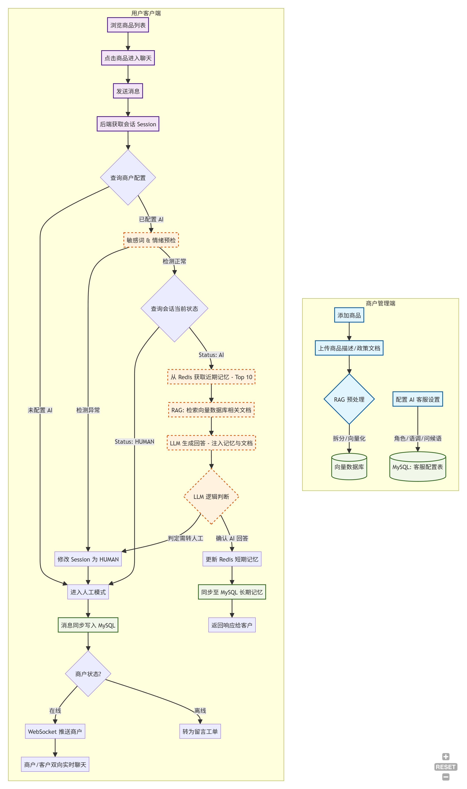

# 企业级电商AI智能客服系统

## 为什么需要AI客服

随着电子商务的快速发展，客户咨询量呈指数级增长，传统的人工客服面临着诸多挑战：

1. **成本压力**：人工客服需要24小时轮班，人力成本高昂
2. **服务时间限制**：人工客服无法同时处理大量并发咨询
3. **服务质量不均**：不同客服人员的专业水平和服务质量存在差异
4. **重复性问题**：大量常见问题需要重复解答，浪费人力资源

AI客服的出现有效解决了这些问题：

- 可以7x24小时不间断服务，无需休息
- 能够同时处理大量客户咨询，响应速度快
- 保证服务的一致性和准确性
- 降低企业运营成本，提高工作效率
- 让人工客服专注于更复杂的个性化问题

## 教学项目框架提供

1. 基本的CRUD接口
2. 基本websocket连接
3. 前端页面

## AI电商客服流程图



### 1. 商户管理端：知识资产与配置

这是系统的初始化阶段，决定了 AI 客服的“智商”和“性格”。

- **商品与策略录入**：商户在管理后台添加商品信息，并上传相关的服务政策（如退换货规则、运费标准等）。
- **RAG 预处理**：系统自动对上传的非结构化文档进行拆分、向量化处理，并存储至向量数据库，为后续的检索增强生成（RAG）做准备。
- **个性化配置**：商户在 MySQL 中配置 AI 的角色定义（如“温柔的导购”）、回复语调以及特定的欢迎语。

### 2. 前置分流：安全检测与成本控制 (核心优化)

该模块旨在通过“最小代价判断”原则，在消耗高额 Token 前过滤无效或特定请求。

- **会话初始化**：后端根据用户 ID 和商品 ID 创建或恢复 Session。
- **商户配置校验**：首先查询 MySQL，确认该商户是否开启了 AI 客服功能。若未开启，直接进入人工模式。
- **敏感词与情绪预检**：利用轻量级算法或正则表达式进行过滤。
- **异常触发**：若检测到违禁词或极端投诉情绪，系统自动将 Session 状态修改为 HUMAN，跳过所有 AI 逻辑。
- **状态分流**：检查 Session 中的 Status 标记。若为 HUMAN，证明该会话已被接管或判定为需人工处理，直接流向人工模块。

### 3. AI 核心链路：深度推理与知识检索

仅在确定由 AI 处理且环境安全时触发，实现精准回复。

- **记忆拉取**：从 Redis 中检索该用户近期（如 Top 10）的聊天记录，构建上下文感知能力。
- **RAG 检索增强**：根据用户当前提问，在向量数据库中检索最相关的商品详情或政策片段。
- **LLM 启发式生成**：将“角色设定 + 历史记忆 + 检索到的知识 + 用户当前提问”组合成 Prompt，由大语言模型生成回答。
- **二次逻辑校验**：
  - **转人工判定**：若 LLM 生成过程中发现用户意图为“投诉”、“要求人工”或知识库无法覆盖，则标记转人工。
  - **更新记忆**：若正常回答，同步更新 Redis（短期记忆）和 MySQL（长期消息记录）。

### 4. 人工兜底：人工服务闭环

确保在 AI 无法解决问题时，用户体验不中断。

- **实时性判断**：系统查询商户当前是否在线。
  - **在线**：通过 WebSocket 或 App 推送实时告知商户，开启双向实时对话。
  - **离线**：引导用户填写留言，系统自动生成工单归档。
- **同步策略**：人工对话的所有记录同步写入 MySQL，以便 AI 在后续会话中能通过“长期记忆”了解人工处理的进度。

## 数据库设计

[数据库文件连接](./sql/ai_customer_service.sql)


## 讲解流程及详细内容

### 传统客服流程与AI客服流程对比

传统客服模式存在以下明显劣势：

- **人力成本高昂**：需要24小时排班，人员工资、培训等成本持续投入
- **服务效率受限**：单个客服同时处理咨询数量有限，高峰期响应缓慢
- **服务质量不稳定**：客服人员经验、情绪等因素影响服务质量
- **重复劳动繁重**：大量常见问题需要反复回答，造成人力资源浪费

AI客服相比传统客服具有显著优势：

- **全天候服务**：7x24小时不间断服务，无休息时间限制
- **高并发处理**：能够同时处理大量客户咨询，大幅提升响应速度
- **服务标准化**：保证服务质量和回复准确性的一致性
- **成本效益明显**：大幅降低人力成本，提高企业运营效率


### 基础项目配置

#### 项目结构分析

```text
com.smileshark # 项目根包（Spring Boot 应用主包）
├── ai # AI 相关功能模块
│   ├── adviser # 自定义 Spring AI Advisor（如 RAG、Memory 等拦截器）
│   ├── memory # 自定义聊天记忆存储与管理逻辑
│   └── service # AI 核心业务服务（如 AIServiceImpl 调用大模型、RAG 等）
├── code # 项目自定义状态码、枚举或错误码定义
├── common # 通用公共类
│   └── Result # 统一接口返回封装类（如 Result.success()、Result.error()）
├── config # Spring 配置类包
│   ├── AIConfig # AI 模型配置（如 DashScope ChatModel、EmbeddingModel）
│   ├── ChatMessageCoder # WebSocket 消息编解码器（自定义文本消息格式）
│   ├── MybatisConfig # MyBatis-Plus 或 MyBatis 配置（如分页插件）
│   ├── VectorStoreConfig # 向量数据库配置（MilvusVectorStore Bean）
│   └── WebSocketConfig # WebSocket 服务端点注册与配置
├── controller # RESTFul 接口控制器层
├── entity # 数据库实体类（对应表结构，通常使用 Lombok @Data）
├── executor # 线程池相关
│   └── GlobalThreadPool # 全局自定义线程池配置
├── mapper # MyBatis Mapper 接口（数据库操作）
├── utils # 工具类包
│   ├── ChineseTokenTextSplitter # 中文友好文档分词器（基于 TokenTextSplitter）
│   ├── FileToDocuments # 文件上传转 Spring AI Document 工具类
│   ├── KeyUtils # 键值工具（如生成会话ID、缓存Key）
│   ├── SessionFind # 会话查找与管理工具
│   └── TypeConversion # 类型转换工具（自定义SessionLog与SpringAI Message类型对应）
├── websocket # WebSocket 实时通信模块
│   ├── endpoint # WebSocket 服务端点
│   │   ├── CommercialTenantEndpoint # 商业租户专用 WebSocket 端点
│   │   ├── UserServiceEndpoint # 用户客服聊天核心端点（处理消息、调用 AI）
│   │   └── WebSocketEndpoint # 通用或基础 WebSocket 端点（接口）
│   └── message # WebSocket 消息实体与相关类
│       └── ChatMessage # 自定义聊天消息结构（包含 type、state、sessionId 等）
└── ServerApplication # Spring Boot 主启动类（@SpringBootApplication）
```
